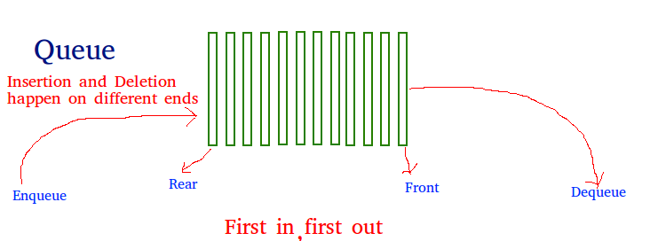

# **Introduction**
#### Linked list allows us to save data on different locations in memory while connecting them with pointer. In other other words, linked list simply means memores linked together with a pointer.
#### When working with linked list, we work with what we call a node (which represent each element in a linked list). In a single-directional linked list, a node will contain a value and a linked (a pointer) to the next node. In Bi-directional liked list, a node will contain both a link to the next node and the previous node.
Before we dive in into what we have for linked list, there are few important terms that you have to familiarize yourself with.

**Value:** This is information or data contained in a node. \
**Node:** Consider this as the container that is being linked together.  \
**Pointers:** This is the address or place where a node is stored in a computer. \
<!-- **Rear/Tail:** Get the last item from queue.  
\
**The picture below will help you understand Queue.** -->

<!--  -->
 
## **Performance**
There are few sets of operations that you can perfrom in a linked list. Each of them has a time that it will take them to execute, which is also called a run time.

**inser_head(value):** This operation Adds "value" to the head of a linked list. When doing this, you check if the linked list have a head. If it does not, then you set the node to be both the head and the tail. If it does have a head, then you set the node's next pointer to the head, the head's prevous pointer to the node, and finally, the head to the node.

**inser_tail(value):** 

## **Use Cases**
As already explained, queue works on FIFO strategy. The two situtation where we can think of the real life application of this:
1. Ticket windows or oulets. When people buy event tickets, the person who comes first gets the first ticket while the peron who comes last get the last ticket.
2. Another good example of real life application of queue is the toll-gates. The vehicle that gets to the toll-gate first, get to leave the toll-gate first.
## **Two Problem to Solve**
Using the above two use cases, solve the following problem
1. I got to a ticket both to buy a ticket. Check to see if there is some before me. If there is serve the very first person and check again if there is some one before me. Continue until there is no one left before me, then serve me.
2. I drove up to a toll-gate, check if I am the first to get there. If I am, let me through, otherwise, have me wait.